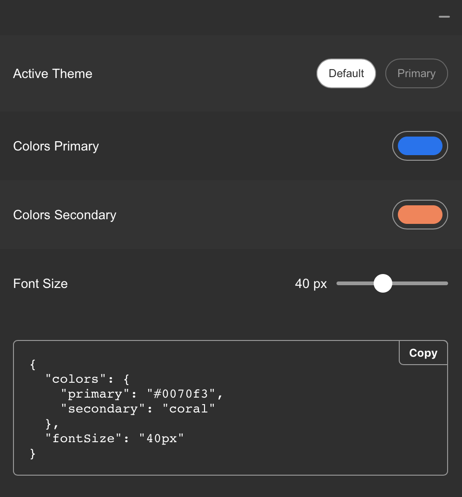

# theme-playground

[](https://www.npmjs.com/package/theme-playground)
[](https://codecov.io/gh/jeslage/theme-playground/)
[](https://circleci.com/gh/jeslage/theme-playground)
[](https://github.com/prettier/prettier)



## Installation

#### 1. Install the package

```sh
npm install -D theme-playground

yarn add -D theme-playground
```

#### 2. Add it to your app

You can use the `withThemePlayground` HOC

```js
import withThemePlayground from 'theme-playground';
import { ThemeProvider } from 'styled-components';

const options = {
  theme: {
    colors: {
      primary: 'red'
    },
    fontSize: '80px'
  },
  hide: process.env.NODE_ENV !== 'development'
};

const App = ({ theme }) => (
  <ThemeProvider theme={theme}>
    <Components />
  </ThemeProvider>
);

export default withThemePlayground(App, options);
```

... or the `ThemePlayground` component with a render function.

```js
import { ThemePlayground } from 'theme-playground';
import { ThemeProvider } from 'styled-components';

const options = {
  theme: {
    colors: {
      primary: 'red'
    },
    fontSize: '80px'
  }
};

const App = () => (
  <ThemePlayground {...options}>
    {theme => (
      <ThemeProvider theme={theme}>
        <Components />
      </ThemeProvider>
    )}
  </ThemePlayground>
);
```

## `useThemePlayground` hook

```js
import { useThemePlayground } from 'theme-playground';
import { ThemeProvider } from 'styled-components';

const ChildComponent = () => {
  const { theme, name } = useThemePlayground();

  return (
    <div>
      <p>Current theme: {name}</p>
      <pre>{JSON.stringify(theme, null, 2)}</pre>
    </div>
  );
};
```

## Options

### `theme`

`object` | `Array<{ name: string, theme: object }>` | required

The theme `object` or multiple themes as an `array` of `objects`. Look at the [Multiple Themes](#multiple-themes) section for an example.

### `overrides`

`object` | optional

Optional [override components](#override-components) of [default components](#default-components). Look at the [Overrides](#overrides) section for detailed documentation.

### `config`

`object` | optional

An additional config object can be added. Look at the [Config](#config) section for detailed documentation.

### `config.labelFormat`

`"path" || "startCase" || (path: string[]) => string` | default: `"startCase"`

### `config.showCode`

`boolean` | default: `true`

Set to `false` no code component will be rendered.

## Multiple Themes

To add multiple themes, add an `Array` to the `theme` key. Each theme must have a `name` and a `theme` key.

```js
import withThemePlayground from 'theme-playground';
import { ThemeProvider } from 'styled-components';

import defaultTheme from 'path/to/default/theme';
import anotherTheme from 'path/to/another/theme';

const options = {
  theme: [
    { name: 'Theme', theme: defaultTheme },
    { name: 'Another Theme', theme: anotherTheme }
  ]
};

const App = ({ theme }) => (
  <ThemeProvider theme={theme}>
    <Components />
  </ThemeProvider>
);

export default withThemePlayground(App, options);
```

## Config

**Example**

```js
import withThemePlayground from 'theme-playground';
import { ThemeProvider } from 'styled-components';

import theme from 'path/to/theme';

const options = {
  theme,
  config: {
    // One of "path"
    labelFormat: 'path', // "button.color"
    // or "startCase"
    labelFormat: 'startCase', // "Button Color"
    // or a custom function
    labelFormat: path => {
      // path is equal to ["button", "color"]
      return path.join('-'); // "button-color"
    },
    showCode: true || false
  }
};

const App = ({ theme }) => (
  <ThemeProvider theme={theme}>
    <Components />
  </ThemeProvider>
);

export default withThemePlayground(App, options);
```

## Overrides

`theme-playground` will render a [default component](#default-components) based on the theme value. If you want to customize them, you can override the default components by adding an `overrides` object to the decorator.

As a key use the theme object path, e.g `'button.spacing'`

**Example**

```js
import withThemePlayground from 'theme-playground';
import { ThemeProvider } from 'styled-components';

import theme from 'path/to/theme';

const config = {
  theme,
  overrides: {
    'button.spacing': {
      type: 'counter',
      label: 'Button Spacing',
      description: 'Spacing for all buttons',
      min: 1,
      max: 20,
      steps: 1
    },
    'button.color.primary': {
      type: 'color',
      label: 'Button Primary Color'
    }
  }
};

const App = ({ theme }) => (
  <ThemeProvider theme={theme}>
    <Components />
  </ThemeProvider>
);

export default withThemePlayground(App, options);
```

### Hide specific theme values

It is also possible to hide specific theme values or objects, e.g.:

```js
const overrides = {
  breakpoints: {
    hidden: true
  },
  'button.spacing': {
    hidden: true
  }
};
```

## Override components

### Color

```js
'theme.path': {
  type: 'color',
  hidden: Boolean,
  label: String | 'Theme Path',
  description: String | null
}
```

### Counter

```js
'theme.path': {
  type: 'counter',
  hidden: Boolean,
  label: String | 'Theme Path',
  description: String | null,
  min: Number | 0,
  max: Number | 100,
  steps: Number | 1
}
```

### Select

```js
'theme.path': {
  type: 'select',
  hidden: Boolean,
  label: String | 'Theme Path',
  description: String | null
  options: [
    {
      value: String,
      label: String
    }
  ]
}
```

### Shorthand

```js
'theme.path': {
  type: 'shorthand',
  hidden: Boolean,
  label: String | 'Theme Path',
  description: String | null
}
```

### Switch

```js
'theme.path': {
  type: 'switch',
  hidden: Boolean,
  label: String | 'Theme Path',
  description: String | null
}
```

### RadioGroup

```js
'theme.path': {
  type: 'radio',
  hidden: Boolean,
  label: String | 'Theme Path',
  description: String | null
  options: [
    {
      value: String,
      label: String
    }
  ]
}
```

### Range

```js
'theme.path': {
  type: 'range',
  hidden: Boolean,
  label: String | 'Theme Path',
  description: String | null,
  min: Number | 0,
  max: Number | 100,
  steps: Number | 1
}
```

## Default components

`theme-playground` will render the following components based on the value.

### `Switch`

> `boolean`

### `Counter`

> `number`

### `Input`

> `string`

### `Textarea`

> `string` && `string.length >= 40`

### `Range`

> `string` && `string.endsWith("px" || "rem" || "em" || "%")`

### `Color`

> `string` && `string.startsWith("#" || "rgba" || "rgba")` || `label.includes("color")`

### `Shorthand`

> `object` && `Object.keys(object).length === 4` && `Object.keys(object).includes("top" && "right" && "bottom" && "left")`
